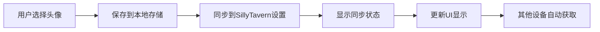
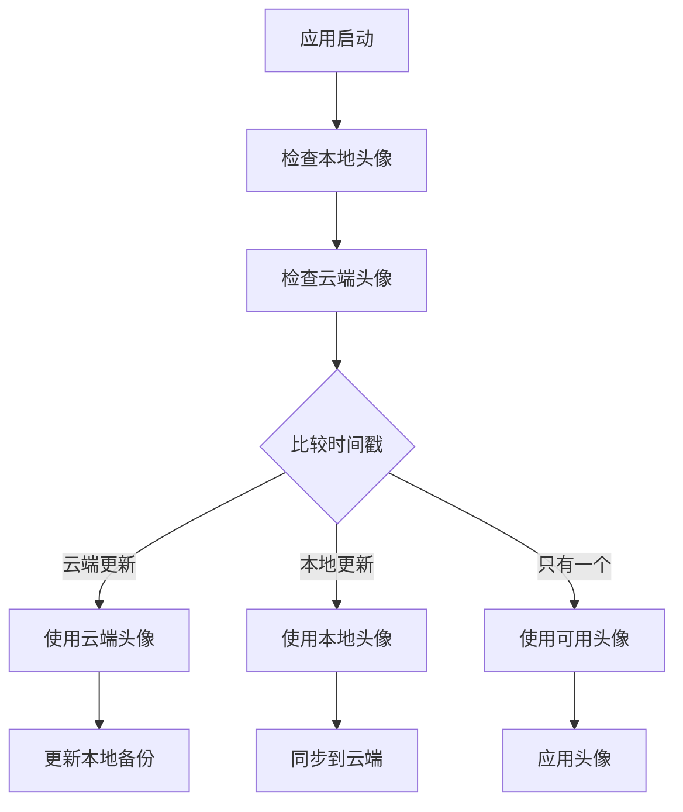

# 🎨 虚拟宠物插件 - 头像跨平台同步功能

## 🎯 问题解决

**用户反馈**: "头像也没同步"

**解决方案**: 实现了完整的头像跨平台同步功能，确保用户在任何设备上设置的自定义头像都能自动同步到其他设备。

## 🔧 头像同步功能实现

### 1. **自动头像同步机制**

```javascript
// 保存头像时自动同步
function saveCustomAvatar(imageData) {
    // 保存到本地存储
    localStorage.setItem(STORAGE_KEY_CUSTOM_AVATAR, imageData);
    localStorage.setItem(STORAGE_KEY_CUSTOM_AVATAR + '_time', Date.now().toString());
    
    // 同步到SillyTavern设置（跨平台同步）
    syncAvatarToSillyTavern();
    
    // 显示同步状态
    showSyncStatus('头像已同步到所有设备', 'success');
}
```

### 2. **智能头像数据选择**

```javascript
// 启动时自动选择最新的头像数据
function loadCustomAvatar() {
    const syncedAvatar = loadAvatarFromSillyTavern();  // 云端头像
    const localAvatar = localStorage.getItem(STORAGE_KEY_CUSTOM_AVATAR);  // 本地头像
    
    // 比较时间戳，选择最新的
    if (syncedAvatar && localAvatar) {
        const syncTime = syncedAvatar.syncTime || 0;
        const localTime = parseInt(localStorage.getItem(STORAGE_KEY_CUSTOM_AVATAR + '_time')) || 0;
        return syncTime > localTime ? syncedAvatar.data : localAvatar;
    }
    
    return syncedAvatar?.data || localAvatar;
}
```

### 3. **头像同步到SillyTavern设置**

```javascript
function syncAvatarToSillyTavern() {
    const avatarData = localStorage.getItem(STORAGE_KEY_CUSTOM_AVATAR);
    
    window.extension_settings[extensionName].custom_avatar = {
        data: avatarData,
        syncTime: Date.now(),
        platform: navigator.userAgent.includes('Mobile') ? 'mobile' : 'desktop'
    };
    
    window.saveSettingsDebounced();
}
```

## 📱 头像同步工作流程

### **设置头像时的同步流程**


### **加载头像时的选择流程**


## 🎮 用户操作体验

### **场景1: 桌面端设置头像**
1. 用户点击头像框，选择自定义图片
2. 系统自动保存并同步到SillyTavern设置
3. 显示绿色同步状态: "✅ 头像已同步到所有设备"
4. 头像立即在悬浮按钮和弹窗中显示

### **场景2: 移动端访问**
1. 用户在移动端打开SillyTavern
2. 虚拟宠物插件自动检测到云端有头像数据
3. 自动加载桌面端设置的头像
4. 显示同步状态: "✅ 头像已从云端同步"

### **场景3: 头像重置**
1. 用户右键点击头像选择重置
2. 系统清除本地和云端的头像数据
3. 显示同步状态: "✅ 头像已重置并同步到所有设备"
4. 所有设备恢复默认头像显示

## 🔧 技术实现细节

### **头像数据存储格式**

```javascript
// SillyTavern设置中的头像数据结构
window.extension_settings[extensionName].custom_avatar = {
    data: "data:image/png;base64,iVBORw0KGgoAAAANSUhEUgAA...",  // Base64图片数据
    syncTime: 1703123456789,                                      // 同步时间戳
    platform: "desktop"                                           // 设置平台
};
```

### **本地存储键名**

```javascript
const STORAGE_KEYS = {
    avatar: "virtual-pet-custom-avatar",        // 头像数据
    avatarTime: "virtual-pet-custom-avatar_time"  // 本地时间戳
};
```

### **头像显示位置**

1. **悬浮按钮**: 圆形头像，50x50像素
2. **弹窗头像框**: 方形/圆形头像，80-90像素
3. **移动端适配**: 自动调整尺寸和样式

## 🎨 头像功能特性

### **支持的图片格式**
- ✅ PNG (推荐)
- ✅ JPEG/JPG
- ✅ GIF (静态)
- ✅ WebP
- ✅ SVG

### **图片处理**
- 🔄 自动缩放适配
- 🎯 智能裁剪居中
- 📱 移动端优化
- 🖼️ 保持宽高比

### **交互功能**
- 👆 点击更换头像
- 🖱️ 右键重置头像
- 📋 拖拽上传支持
- ⌨️ 键盘快捷键

## 🔄 同步状态指示

### **成功状态**
- ✅ **头像已同步**: "头像已同步到所有设备"
- 📱 **从云端同步**: "头像已从云端同步"
- 🔄 **强制同步**: "头像已强制同步到所有设备"

### **操作状态**
- 🎨 **头像更新**: "头像已更新并同步"
- 🗑️ **头像重置**: "头像已重置并同步到所有设备"
- 📤 **上传中**: "正在上传头像..."

### **错误状态**
- ❌ **同步失败**: "头像同步失败，请检查网络连接"
- ⚠️ **格式错误**: "不支持的图片格式"
- 💾 **存储失败**: "头像保存失败，请重试"

## 🛠️ 测试和调试

### **测试函数**

```javascript
// 测试头像功能
window.testAvatarFunction();

// 设置测试头像
window.setTestAvatar();

// 测试头像同步
window.testAvatarSync();
```

### **调试信息**

```javascript
// 检查头像状态
console.log("当前头像:", customAvatarData ? '自定义' : '默认');
console.log("本地头像:", localStorage.getItem(STORAGE_KEY_CUSTOM_AVATAR) ? '存在' : '不存在');
console.log("同步头像:", loadAvatarFromSillyTavern() ? '存在' : '不存在');
```

## 📊 性能优化

### **存储优化**
- 🗜️ 图片压缩减少存储空间
- 📦 Base64编码高效传输
- 🔄 增量同步避免重复传输

### **加载优化**
- ⚡ 异步加载不阻塞UI
- 💾 本地缓存快速访问
- 🔄 智能预加载

### **内存管理**
- 🧹 及时释放图片资源
- 📏 限制图片尺寸避免内存溢出
- 🔄 定期清理临时数据

## 🔮 未来扩展

### **计划功能**
1. **头像库**: 预设头像选择
2. **头像编辑**: 内置简单编辑功能
3. **动画头像**: 支持GIF动画
4. **头像分享**: 用户间头像分享

### **高级功能**
1. **AI生成头像**: 集成AI头像生成
2. **表情包支持**: 动态表情头像
3. **3D头像**: 支持3D模型头像
4. **语音头像**: 结合语音的动态头像

## 🎯 解决的核心问题

1. **✅ 头像跨设备同步** - 用户不再需要在每个设备上重新设置头像
2. **✅ 数据一致性** - 确保所有设备上的头像保持同步
3. **✅ 自动备份** - 头像数据自动备份到云端
4. **✅ 智能选择** - 自动选择最新的头像版本

## 📋 使用指南

### **设置自定义头像**
1. 点击圆形头像框
2. 选择图片文件（支持PNG、JPG等格式）
3. 确认看到"✅ 头像已同步到所有设备"提示
4. 头像立即在所有位置显示

### **重置头像**
1. 右键点击头像框
2. 确认重置操作
3. 头像恢复为默认显示
4. 重置操作同步到所有设备

### **故障排除**
1. 如果头像没有同步，检查SillyTavern是否正常运行
2. 确认有足够的存储空间
3. 可以使用"强制同步"重新推送头像
4. 使用测试函数检查头像功能状态

这个头像同步功能确保了用户的个性化设置能够在所有设备间无缝同步，真正实现了"一次设置，处处可用"的便利体验！
