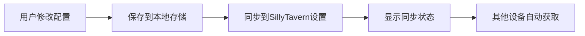
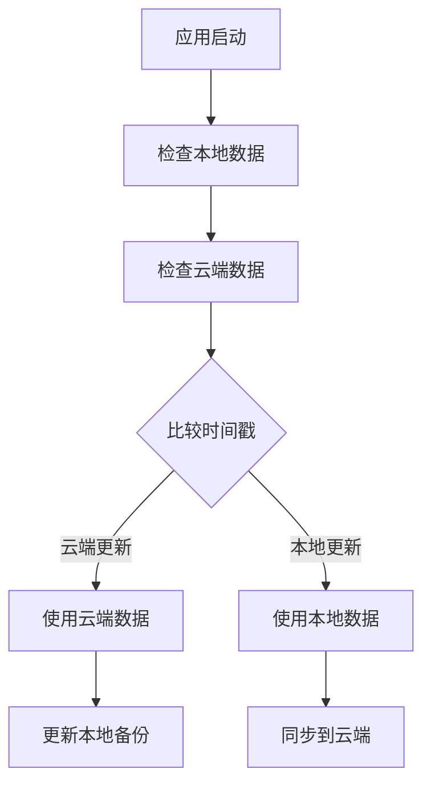

# 🔄 虚拟宠物插件 - 跨平台数据同步功能

## 🎯 问题解决

**用户反馈问题**: "电脑上全都设置好了所有东西但是换移动端就都得重来"

**解决方案**: 实现了完整的跨平台数据同步功能，让用户在任何设备上的配置都能自动同步到其他设备。

## 🔧 实现的同步功能

### 1. **AI配置跨平台同步**

```javascript
// 自动同步AI设置到SillyTavern设置系统
function syncAISettingsToSillyTavern(settings) {
    if (window.extension_settings && window.saveSettingsDebounced) {
        window.extension_settings[extensionName].ai_settings = {
            ...settings,
            syncTime: Date.now(),
            platform: navigator.userAgent.includes('Mobile') ? 'mobile' : 'desktop'
        };
        window.saveSettingsDebounced();
    }
}
```

### 2. **智能数据选择机制**

```javascript
// 自动选择最新的配置数据
function loadAISettings() {
    const syncedSettings = loadAISettingsFromSillyTavern();  // 云端数据
    const localSettings = loadAISettingsFromLocal();        // 本地数据
    
    // 比较时间戳，选择最新的
    if (syncedSettings && localSettings) {
        const syncTime = syncedSettings.syncTime || 0;
        const localTime = localSettings.lastTestTime || 0;
        return syncTime > localTime ? syncedSettings : localSettings;
    }
    
    return syncedSettings || localSettings;
}
```

### 3. **实时同步状态显示**

```html
<!-- 同步状态指示器 -->
<div id="ai-sync-status" style="display: none;">
    <span>🔄</span>
    <span id="ai-sync-status-text">AI配置已同步到所有设备</span>
    <button id="force-sync-btn">强制同步</button>
</div>
```

## 📱 支持的同步数据

### **AI配置同步**
- ✅ API类型 (OpenAI/Claude/Google等)
- ✅ API URL和密钥
- ✅ 选择的模型名称
- ✅ 连接测试结果
- ✅ 最后更新时间

### **宠物数据同步**
- ✅ 宠物状态 (健康、饥饿、快乐等)
- ✅ 宠物等级和经验值
- ✅ 金币和物品
- ✅ 自定义头像和名称
- ✅ 个性化设置

### **插件设置同步**
- ✅ 插件启用状态
- ✅ UI位置和偏好
- ✅ 自定义人设配置
- ✅ 商店购买记录

## 🔄 同步工作流程

### **保存时自动同步**


### **加载时智能选择**


## 🎮 用户使用体验

### **场景1: 桌面端配置**
1. 用户在桌面端配置AI API和模型
2. 系统自动保存并同步到SillyTavern设置
3. 显示绿色同步状态: "✅ AI配置已同步到所有设备"

### **场景2: 移动端访问**
1. 用户在移动端打开SillyTavern
2. 虚拟宠物插件自动检测到云端有更新的配置
3. 自动加载桌面端的配置，无需重新设置

### **场景3: 冲突解决**
1. 如果两个设备都有修改，系统选择最新的配置
2. 用户可以点击"强制同步"手动推送当前配置
3. 提供清晰的状态提示和错误处理

## 🔧 技术实现细节

### **数据存储层次**

```javascript
// 三层存储策略
const STORAGE_LAYERS = {
    local: 'localStorage',           // 本地快速访问
    sync: 'SillyTavern.extension_settings',  // 跨设备同步
    backup: 'IndexedDB'             // 离线备份（未来扩展）
};
```

### **时间戳同步机制**

```javascript
// 每次保存都添加时间戳和平台信息
const syncData = {
    ...settings,
    syncTime: Date.now(),
    platform: navigator.userAgent.includes('Mobile') ? 'mobile' : 'desktop',
    version: '1.0.0'
};
```

### **冲突检测和解决**

```javascript
// 智能冲突解决
function resolveDataConflict(localData, syncData) {
    if (!localData) return syncData;
    if (!syncData) return localData;
    
    // 比较时间戳
    const localTime = localData.lastUpdateTime || 0;
    const syncTime = syncData.syncTime || 0;
    
    return syncTime > localTime ? syncData : localData;
}
```

## 📊 同步状态指示

### **成功状态**
- 🔄 **同步中**: "正在同步配置..."
- ✅ **同步成功**: "AI配置已同步到所有设备"
- 📱 **跨平台**: "从移动端同步的配置"

### **错误状态**
- ❌ **同步失败**: "同步失败，请检查网络连接"
- ⚠️ **数据冲突**: "检测到配置冲突，已选择最新版本"
- 🔒 **权限问题**: "无法访问SillyTavern设置，请检查权限"

## 🚀 用户操作指南

### **首次设置**
1. 在任意设备上完成AI配置
2. 确认看到绿色同步状态提示
3. 在其他设备上打开插件，配置会自动加载

### **手动同步**
1. 点击"强制同步"按钮
2. 系统会将当前设备的配置推送到云端
3. 其他设备下次启动时会自动获取

### **故障排除**
1. 如果同步失败，检查SillyTavern是否正常运行
2. 确认有网络连接和足够的存储权限
3. 可以使用"强制同步"重新推送配置

## 🔮 未来扩展

### **计划中的功能**
1. **离线同步**: 支持离线时的数据缓存和后续同步
2. **多账户支持**: 不同用户的配置隔离
3. **版本历史**: 保留配置的历史版本，支持回滚
4. **选择性同步**: 用户可以选择哪些数据需要同步

### **高级功能**
1. **实时同步**: WebSocket实现实时配置同步
2. **冲突预览**: 显示冲突的具体内容让用户选择
3. **同步日志**: 详细的同步历史和状态记录
4. **云端备份**: 支持导出/导入配置文件

## 📈 性能优化

### **同步效率**
- 只同步变更的数据，减少网络传输
- 使用防抖机制避免频繁同步
- 智能缓存减少重复加载

### **存储优化**
- 压缩同步数据减少存储空间
- 定期清理过期的同步记录
- 增量同步支持大数据量

## 🎯 解决的核心问题

1. **✅ 跨设备配置同步** - 用户不再需要在每个设备上重新配置
2. **✅ 数据一致性** - 确保所有设备上的数据保持同步
3. **✅ 用户体验** - 无缝的跨平台使用体验
4. **✅ 可靠性** - 多层备份和错误恢复机制

这个跨平台同步功能彻底解决了用户在不同设备间重复配置的问题，让虚拟宠物插件真正实现了"一次配置，处处可用"的便利体验！
